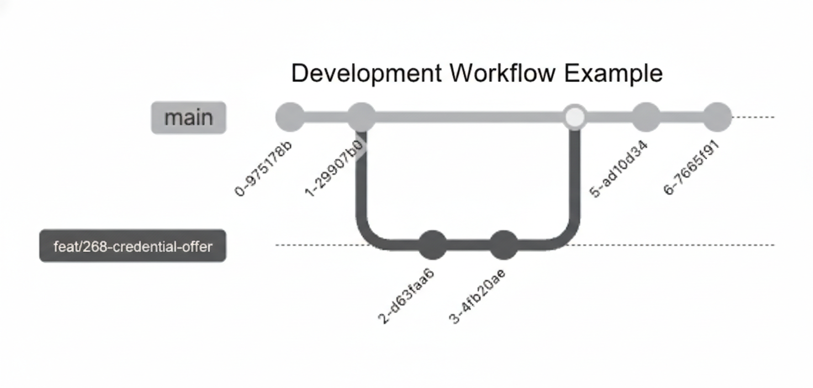

# Contributing to VC Knots

First off, thank you for considering contributing to VC Knots! We truly appreciate your interest and effort.

This document outlines our guidelines for contributions. Please take a moment to review it to ensure a smooth and effective collaboration.

## Table of Contents

- [Code of Conduct](#code-of-conduct)
- [How Can I Contribute?](#how-can-i-contribute)
  - [Reporting Bugs](#reporting-bugs)
  - [Suggesting Enhancements](#suggesting-enhancements)
  - [Pull Requests](#pull-requests)
- [Development Setup](#development-setup)
- [Development Workflow](#development-workflow)
  - [Main Branch](#main-branch)
  - [Branching Strategy](#branching-strategy)
  - [Pull Request Process](#pull-request-process)
- [Coding Standards](#coding-standards)
- [Automated dependency updates](#automated-dependency-updates)
- [License](#license)

## Code of Conduct

We are committed to fostering an open and welcoming environment. All contributors are expected to read and adhere to our [Code of Conduct](./CODE_OF_CONDUCT.md). Please report any unacceptable behavior.

## How Can I Contribute?

There are many ways to contribute, from writing code and documentation to reporting bugs and suggesting new features.

### Reporting Bugs

If you find a bug, please ensure it hasn't already been reported by searching our [GitHub Issues](https://github.com/trustknots/vcknots/issues).

If you can't find an existing issue, please open a new one. Be sure to include:
- A clear and descriptive title.
- Steps to reproduce the bug.
- The expected behavior.
- The actual behavior (and screenshots, if applicable).
- Your environment details (OS, vcknots version, etc.).

### Suggesting Enhancements

We welcome suggestions for new features or improvements. Please open an issue in [GitHub Issues]([https://github.com/trustknots/vcknots/issues]) to discuss your idea.
- Explain the "why": What problem does this solve? What is the use case?
- Be as specific as possible in your description.

### Pull Requests

Code contributions are highly welcome! If you plan to make a significant change, please open an issue to discuss it first. This helps prevent duplicated or unnecessary work.

For small changes or bug fixes, you can submit a Pull Request (PR) directly.

## Development Setup

Ready to contribute code? Here’s how to set up VC Knots for local development.

### Repository Setup

1. **Fork** the repository.
2. **Clone** your fork locally:
  ```bash
  git clone https://github.com/your-username/your-repo-name.git
  cd your-repo-name
  ```

3. (Optional but Recommended) Add the original repository as an `upstream` remote:
  ```bash
  git remote add upstream https://github.com/trustknots/vcknots.git
  ```

### Wallet Setup

Please refer to the [Wallet Setup](https://trustknots.github.io/vcknots/docs/wallet) documentation for detailed instructions.


### Issuer and Verifier Setup

1. **Install dependencies**.
  ```bash
  # Make sure you use pnpm instead of npm
  pnpm install
  ```

2. **Run tests** to ensure everything is working correctly.
  ```bash
  pnpm test
  ```
## Development Workflow

We follow a simple branching strategy to keep the development process smooth and the history clean.

### Main Branch
- **`main`**: This is our production-ready branch. All new features and bug fixes are integrated here via Pull Requests.

<p align="center">

<br>
*Example: Overview of the development lifecycle from feature branching to squash merging.*
</p>

### Branching Strategy
1. **Fork the repository**: Create your own copy of the repository on GitHub.
2. **Create a branch**: Create a new branch for each backlog item (Issue) from the `main` branch.
   - Recommended naming: `feat/issue-number-description` or `fix/issue-number`
3. **Commit your changes**: You are free to commit as often as you like during development. However,  please write clear and descriptive commit messages by following [Conventional Commits](https://www.conventionalcommits.org/en/v1.0.0/).
4. **Open a Pull Request**: Once your work is ready, create a PR to the `main` branch. 
   - If possible, having your PR reviewed by at least one maintainer is encouraged.   
5. **Squash and Merge**: All PRs will be merged using **Squash Merge**. This keeps our `main` branch history clean by combining all your commits into a single, meaningful commit.
6. **Branch Deletion**: Once the Pull Request is merged, the maintainer will delete the branch on the remote repository. Please make sure to delete your local branch as well to keep your environment tidy.

### Pull Request Process

1. **Create a new branch** from the `main` (or `master`) branch.
  (Make sure to pull the latest changes from `upstream` first: `git pull upstream main`)
  ```bash
  # Example for a new feature
  git switch -c feat/your-new-feature

  # Example for a bug fix
  git switch -c fix/describe-the-fix
  ```

2. **Make your changes** and add your code.
  - Add or update tests for your changes.
  - Ensure all tests pass.

3. **Commit** your changes. Please write clear and descriptive commit messages by following [Conventional Commits](https://www.conventionalcommits.org/en/v1.0.0/)
  ```bash
  git add .
  git commit -m "feat(wallet): Add amazing new feature"
  ```

4. **Push** your branch to your fork:
    ```bash
    git push origin feat/your-new-feature
    ```

5.  **Open a Pull Request** (PR) from your fork to the original repository's `main` branch.
    - Link any relevant issues (e.g., "Closes #123").
    - Provide a clear description of your changes.

6.  **Wait for review.** A maintainer will review your PR. We may request changes. Once approved, your PR will be merged. Thank you for your contribution!

## Coding Standards

To maintain code consistency, we use [Biome](https://biomejs.dev/). Please run the linter/formatter before submitting your PR.

```bash
pnpm run lint
pnpm run format
```

## Automated dependency updates

We use Renovate to automate dependency updates and open pull requests based on the configuration in renovate.json.

- Schedule:Sundays 19:00–23:59 JST
- Release age delay: PRs are created only after a release has been out for 5 day
- Branch: Renovate branches are prefixed with `build/`
- Auto-merge: Patch updates only are eligible for auto-merge, and only within Sundays 00:00–04:59 JST
- Commit messages:
  - the commit type is always `build`
  - Format: build: update `topic`
    - `topic` rules: If a `groupName` applies, the `topic` is `groupName` (e.g. wallet); otherwise, it uses the dependency name `depName` (e.g. pnpm, dependencies)
    - Groups: Each group uses `rangeStrategy: pin`
      - issuer+verifier
      - server-multi
      - server-single
      - wallet
      - google-cloud
      - docusaurus
      - node-version

## License

By contributing to VC Knots, you agree that your contributions will be licensed under Apache License 2.0 (see [LICENSE](./LICENSE) file).
